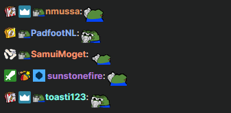
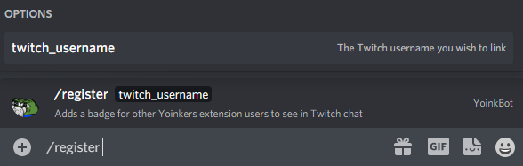

# Twitch Yoink browser extension

  

## Download the extension for your browser

**Awaiting review, the Opera extension is only available in Opera Developer and Opera Next:**

## Usage

Install the extension, and see a badge next to your fellow Yoinkers.

To get a Yoink badge next to your name, you must register your Twitch username in the YoinkBuddies Discord:

## Build

### Browser extension

See [`yoink-browser-extension` README](packages/yoink-browser-extension)

### Discord bot

See [`yoink-discord-bot` README](packages/yoink-discord-bot)